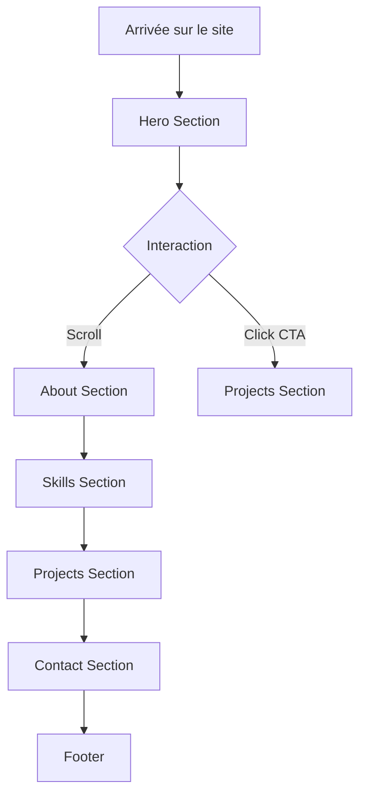

# 📋 Architecture du Portfolio - Hamza Benmoussa

## 🎯 Stack Technique (Cutting-Edge 2025)

| Catégorie | Technologie | Justification |
|-----------|-------------|---------------|
| **Framework** | Next.js 14 (App Router) | Server components, SEO optimal, performance |
| **Language** | TypeScript | Type safety, maintenabilité |
| **Styling** | Tailwind CSS | Utility-first, rapide, moderne |
| **Animations** | Framer Motion | Animations fluides, gestures |
| **Icons** | Lucide React | Design moderne, léger |
| **Fonts** | Inter + JetBrains Mono | Lisibilité + code aesthetic |
| **Deployment** | Vercel | Native Next.js support |

---

## 🎨 Design System

### Thème
- **Mode**: Dark mode par défaut (élégant, moderne)
- **Palette**: 
  - Background: `#0a0a0a` (quasi-noir)
  - Primary: `#6366f1` (Indigo) → `#a855f7` (Purple) gradient
  - Accent: `#22d3ee` (Cyan) pour les highlights
  - Text: `#f8fafc` ( Slate-50)

### Effets Visuels
- **Glassmorphism**: Cartes avec backdrop-blur
- **Gradients mesh**: Background animé subtil
- **Glow effects**: Box-shadows colorés
- **Micro-interactions**: Hover states smooth

---

## 📁 Structure du Projet

```
portfolio/
├── app/
│   ├── layout.tsx          # Root layout avec providers
│   ├── page.tsx            # Homepage (sections)
│   └── globals.css         # Global styles + Tailwind
├── components/
│   ├── ui/
│   │   ├── Button.tsx      # Bouton réutilisable
│   │   ├── Card.tsx        # Card component
│   │   └── Badge.tsx       # Skill badges
│   ├── sections/
│   │   ├── Hero.tsx        # Intro avec typing effect
│   │   ├── About.tsx       # À propos
│   │   ├── Skills.tsx      # Compétences (scroll animated)
│   │   ├── Projects.tsx    # Projets (placeholder)
│   │   └── Contact.tsx     # Formulaire + links
│   └── layout/
│       ├── Navbar.tsx      # Navigation sticky
│       └── Footer.tsx      # Footer simple
├── lib/
│   └── utils.ts            # Helper functions
├── public/
│   └── assets/             # Images, icons
└── package.json
```

---

## 🧩 Composants Détaillés

### 1. Hero Section
```
- Typing effect pour le titre
- Particle background ou gradient mesh
- CTA buttons: "Voir mes projets" + "Me contacter"
- Social links icons (GitHub, LinkedIn, Twitter)
```

### 2. About Section
```
- Photo professionnelle (placeholder)
- Bio narrative
- Timeline: Formation ISGA + parcours
-价值观: Innovation, Quality, User-centric
```

### 3. Skills Section
```
- Grid de skills par catégorie:
  * Frontend: React, Next.js, TypeScript, Tailwind
  * Backend: Node.js, Express, PostgreSQL
  * Tools: Git, Docker, AWS
- Animations à l'apparition (scroll-triggered)
```

### 4. Projects Section (Placeholder)
```
- Cards avec:
  * Thumbnail
  * Titre et description
  * Tech stack utilisé
  * Liens: GitHub + Live Demo
- User fournira les projets plus tard
```

### 5. Contact Section
```
- Simple email link
- Formulaire (Netlify Forms ou Formspree)
- Liens sociaux
```

---

## 🔄 Flux Utilisateur



---

## 📱 Responsiveness

- **Desktop**: Full experience avec animations complètes
- **Tablet**: Adaptations des grid layouts
- **Mobile**: Stack vertical, animations réduites pour performance

---

## 🚀 Prochaines Étapes (Code Mode)

1. Initialiser le projet Next.js 14
2. Configurer Tailwind CSS avec le theme
3. Créer les composants UI de base
4. Implémenter chaque section
5. Ajouter les animations Framer Motion
6. Tester et déployer

---

*Plan créé pour Hamza Benmoussa - Étudiant en 4ème année Ingénierie des Systèmes Informatiques à ISGA Fès*

## 🎯 Stack Technique (Cutting-Edge 2025)

| Catégorie | Technologie | Justification |
|-----------|-------------|---------------|
| **Framework** | Next.js 14 (App Router) | Server components, SEO optimal, performance |
| **Language** | TypeScript | Type safety, maintenabilité |
| **Styling** | Tailwind CSS | Utility-first, rapide, moderne |
| **Animations** | Framer Motion | Animations fluides, gestures |
| **Icons** | Lucide React | Design moderne, léger |
| **Fonts** | Inter + JetBrains Mono | Lisibilité + code aesthetic |
| **Deployment** | Vercel | Native Next.js support |

---

## 🎨 Design System

### Thème
- **Mode**: Dark mode par défaut (élégant, moderne)
- **Palette**: 
  - Background: `#0a0a0a` (quasi-noir)
  - Primary: `#6366f1` (Indigo) → `#a855f7` (Purple) gradient
  - Accent: `#22d3ee` (Cyan) pour les highlights
  - Text: `#f8fafc` ( Slate-50)

### Effets Visuels
- **Glassmorphism**: Cartes avec backdrop-blur
- **Gradients mesh**: Background animé subtil
- **Glow effects**: Box-shadows colorés
- **Micro-interactions**: Hover states smooth

---

## 📁 Structure du Projet

```
portfolio/
├── app/
│   ├── layout.tsx          # Root layout avec providers
│   ├── page.tsx            # Homepage (sections)
│   └── globals.css         # Global styles + Tailwind
├── components/
│   ├── ui/
│   │   ├── Button.tsx      # Bouton réutilisable
│   │   ├── Card.tsx        # Card component
│   │   └── Badge.tsx       # Skill badges
│   ├── sections/
│   │   ├── Hero.tsx        # Intro avec typing effect
│   │   ├── About.tsx       # À propos
│   │   ├── Skills.tsx      # Compétences (scroll animated)
│   │   ├── Projects.tsx    # Projets (placeholder)
│   │   └── Contact.tsx     # Formulaire + links
│   └── layout/
│       ├── Navbar.tsx      # Navigation sticky
│       └── Footer.tsx      # Footer simple
├── lib/
│   └── utils.ts            # Helper functions
├── public/
│   └── assets/             # Images, icons
└── package.json
```

---

## 🧩 Composants Détaillés

### 1. Hero Section
```
- Typing effect pour le titre
- Particle background ou gradient mesh
- CTA buttons: "Voir mes projets" + "Me contacter"
- Social links icons (GitHub, LinkedIn, Twitter)
```

### 2. About Section
```
- Photo professionnelle (placeholder)
- Bio narrative
- Timeline: Formation ISGA + parcours
-价值观: Innovation, Quality, User-centric
```

### 3. Skills Section
```
- Grid de skills par catégorie:
  * Frontend: React, Next.js, TypeScript, Tailwind
  * Backend: Node.js, Express, PostgreSQL
  * Tools: Git, Docker, AWS
- Animations à l'apparition (scroll-triggered)
```

### 4. Projects Section (Placeholder)
```
- Cards avec:
  * Thumbnail
  * Titre et description
  * Tech stack utilisé
  * Liens: GitHub + Live Demo
- User fournira les projets plus tard
```

### 5. Contact Section
```
- Simple email link
- Formulaire (Netlify Forms ou Formspree)
- Liens sociaux
```

---

## 🔄 Flux Utilisateur


---

## 📱 Responsiveness

- **Desktop**: Full experience avec animations complètes
- **Tablet**: Adaptations des grid layouts
- **Mobile**: Stack vertical, animations réduites pour performance

---

## 🚀 Prochaines Étapes (Code Mode)

1. Initialiser le projet Next.js 14
2. Configurer Tailwind CSS avec le theme
3. Créer les composants UI de base
4. Implémenter chaque section
5. Ajouter les animations Framer Motion
6. Tester et déployer

---

*Plan créé pour Hamza Benmoussa - Étudiant en 4ème année Ingénierie des Systèmes Informatiques à ISGA Fès*

